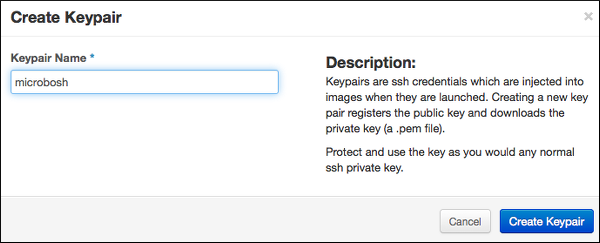
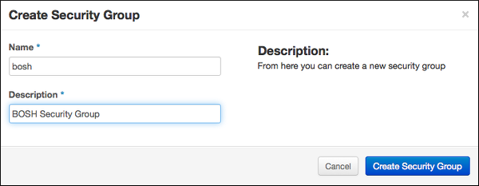
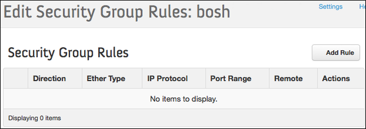

This document shows how to initialize new [environment](terminology.md#environment) on OpenStack.

## Step 1: Prepare an OpenStack environment {: #prepare-openstack }

### Prerequisites {: #prerequisites }

1. An OpenStack environment running one of the following supported releases:
    * [Liberty](http://www.openstack.org/software/liberty) (actively tested)
    * [Mitaka](http://www.openstack.org/software/mitaka) (actively tested)
    * [Newton](http://www.openstack.org/software/newton) (actively tested)

    !!! tip
        Juno has a [bug](https://bugs.launchpad.net/nova/+bug/1396854) that prevents BOSH to assign specific IPs to VMs. You have to apply a Nova patch to avoid this problem.

1. The following OpenStack services:
    * [Identity](https://www.openstack.org/software/releases/ocata/components/keystone):
        BOSH authenticates credentials and retrieves the endpoint URLs for other OpenStack services.
    * [Compute](https://www.openstack.org/software/releases/ocata/components/nova):
        BOSH boots new VMs, assigns floating IPs to VMs, and creates and attaches volumes to VMs.
    * [Image](https://www.openstack.org/software/releases/ocata/components/glance):
        BOSH stores stemcells using the Image service.
    * **(Optional)** [OpenStack Networking](https://www.openstack.org/software/releases/ocata/components/neutron):
        Provides network scaling and automated management functions that are useful when deploying complex distributed systems. **Note:** OpenStack networking is used as default as of v28 of the OpenStack CPI. To disable the use of the OpenStack Networking project, see [using nova-networking](openstack-nova-networking.md).

1. The following OpenStack networks:
    * An external network with a subnet.
    * An private network with a subnet. The subnet must have an IP address allocation pool.

1. Configuration of a new OpenStack Project
    1. Automated configuration

        You can use a [Terraform enviroment template](https://github.com/cloudfoundry-incubator/bosh-openstack-environment-templates/tree/master/bosh-init-tf) to configure your OpenStack project.

    1. Manual configuration

        !!! note
            See the [OpenStack documentation](http://docs.openstack.org/) for help finding more information.

        Alternatively, you can do the following things manually as described below:
        * Create a [Keypair](#keypair).
        * Create and configure [Security Groups](#security-groups).
        * Allocate a [floating IP address](#floating-ip).

---
### Create a Keypair {: #keypair }

1. Select **Access & Security** from the left navigation panel.

1. Select the **Keypairs** tab.

    

1. Click **Create Keypair**.

1. Name the Keypair "bosh" and click **Create Keypair**.

    

1. Save the `bosh.pem` file to `~/Downloads/bosh.pem`.

    

---
### Create and Configure Security Groups {: #security-groups }

You must create and configure two Security Groups to restrict incoming network traffic to the BOSH VMs.

#### BOSH Security Group

1. Select **Access & Security** from the left navigation panel.

1. Select the **Security Groups** tab.

    

1. Click **Create Security Group**.

1. Name the security group "bosh" and add the description "BOSH Security Group"

    

1. Click **Create Security Group**.

1. Select the BOSH Security Group and click **Edit Rules**.

1. Click **Add Rule**.

    

1. Add the following rules to the BOSH Security Group:

    !!! warning
        It highly discouraged to run any production environment with `0.0.0.0/0` source or to make any BOSH management ports publicly accessible.

    <table border="1" class="nice" >
      <tr>
        <th>Direction</th>
        <th>Ether Type</th>
        <th>IP Protocol</th>
        <th>Port Range</th>
        <th>Remote</th>
        <th>Purpose</th>
      </tr>

      <tr><td>Ingress</td><td>IPv4</td><td>TCP</td><td>22</td><td>0.0.0.0/0 (CIDR)</td><td>SSH access from CLI</td></tr>
      <tr><td>Ingress</td><td>IPv4</td><td>TCP</td><td>6868</td><td>0.0.0.0/0 (CIDR)</td><td>BOSH Agent access from CLI</td></tr>
      <tr><td>Ingress</td><td>IPv4</td><td>TCP</td><td>25555</td><td>0.0.0.0/0 (CIDR)</td><td>BOSH Director access from CLI</td></tr>

      <tr><td>Egress</td><td>IPv4</td><td>Any</td><td>-</td><td>0.0.0.0/0 (CIDR)</td></tr>
      <tr><td>Egress</td><td>IPv6</td><td>Any</td><td>-</td><td>::/0 (CIDR)</td></tr>

      <tr><td>Ingress</td><td>IPv4</td><td>TCP</td><td>1-65535</td><td>bosh</td><td>Management and data access</td></tr>
    </table>

---
### Allocate a floating IP address {: #floating-ip }

1. Select **Access & Security** from the left navigation panel.

1. Select the **Floating IPs** tab.

    

1. Click **Allocate IP to Project**.

1. Select **External** from the **Pool** dropdown menu.

1. Click **Allocate IP**.

    

1. Replace `FLOATING-IP` in your deployment manifest with the allocated Floating IP Address.

    

---
## Step 2: Deploy {: #deploy }

1. Install [CLI v2](./cli-v2.html).

1. Use `bosh create-env` command to deploy the Director.

    ```shell
    # Create directory to keep state
    $ mkdir bosh-1 && cd bosh-1

    # Clone Director templates
    $ git clone https://github.com/cloudfoundry/bosh-deployment

    # Fill below variables (replace example values) and deploy the Director
    $ bosh create-env bosh-deployment/bosh.yml \
        --state=state.json \
        --vars-store=creds.yml \
        -o bosh-deployment/openstack/cpi.yml \
        -v director_name=bosh-1 \
        -v internal_cidr=10.0.0.0/24 \
        -v internal_gw=10.0.0.1 \
        -v internal_ip=10.0.0.6 \
        -v auth_url=test \
        -v az=test \
        -v default_key_name=test \
        -v default_security_groups=[test] \
        -v net_id=test \
        -v openstack_password=test \
        -v openstack_username=test \
        -v openstack_domain=test \
        -v openstack_project=test \
        -v private_key=test \
        -v region=test
    ```

    If running above commands outside of an OpenStack network, refer to [Exposing environment on a public IP](init-external-ip.md) for additional CLI flags.

    See [OpenStack CPI errors](openstack-cpi.md#errors) for list of common errors and resolutions.

1. Connect to the Director.

    ```shell
    # Configure local alias
    $ bosh alias-env bosh-1 -e 10.0.0.6 --ca-cert <(bosh int ./creds.yml --path /director_ssl/ca)

    # Log in to the Director
    $ export BOSH_CLIENT=admin
    $ export BOSH_CLIENT_SECRET=`bosh int ./creds.yml --path /admin_password`

    # Query the Director for more info
    $ bosh -e bosh-1 env
    ```

1. Save the deployment state files left in your deployment directory `bosh-1` so you can later update/delete your Director. See [Deployment state](cli-envs.md#deployment-state) for details.
