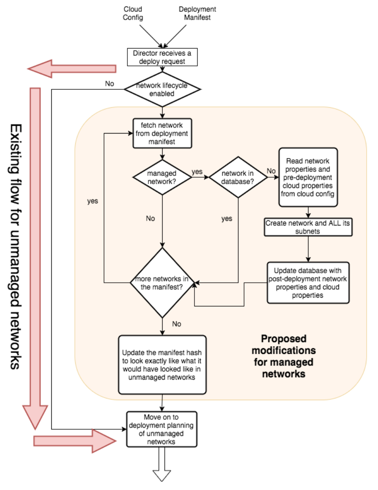

!!! note
    Available as of BOSH Director version 268.1.0

Historically, users had to manually create, update, or delete networks before configuring BOSH to use them. With managed networks, BOSH can manage the lifecycle of a deployment's networks by dynamically creating, updating and deleting them when needed at the IaaS layer.

Network definitions are still defined in the cloud config. This allows for seamless integration between networks that are not lifecycle managed (the existing default of BOSH) and those that will be managed.

When a platform operator defines a logical network at the `cloud config` manifest, it will specify if the network is `managed` or `unmanaged` (by default it will be `unmanaged` for backwards compatibility).

To enable the managed network lifecycle, the Operator needs to enable it in `cloud config`, making sure that `managed` is set to `true` under the network definition:

```
networks:
  name: my-network
    type: manual
    managed: true
    subnets:
    - range: 10.10.0.0/24
      gateway: 10.10.0.1
      dns: [8.8.8.8]
      static: [10.10.0.11-10.10.0.20]
      cloud_properties: {}
```

The current status of `network_lifecycle` can be checked on BOSH environment info:
```
$ bosh environment
Using environment '30.0.0.1' as client 'admin'

Name      p-bosh
UUID      b16a53aa-c426-4b5c-b7bd-b7e28eb28df1
Version   268.5.0 (00000000)
CPI       vsphere_cpi
Features  compiled_package_cache: enabled
          config_server: enabled
          dns: disabled
          network_lifecycle: enabled
          snapshots: disabled
User      admin

Succeeded
```

## Lifecycle




## Implementation

CPI authors looking to provide managed networks functionality should refer to [create_network](./cpi-api-v1-method/create_network.md) and [delete_network](./cpi-api-v1-method/delete_network.md) methods documentation.

[vSphere CPI](vsphere-cpi.md#networks) currently provides a concrete implementation of managed networks.